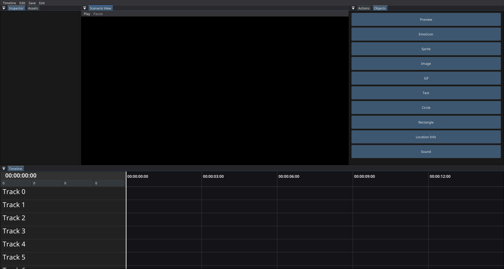
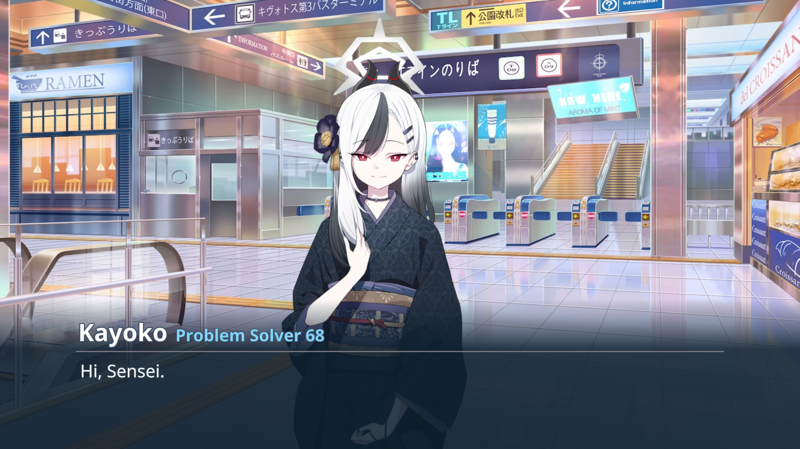

# Base (Blue Archive Scenario Engine)
This is a fun project of mine aims to uh allow you to freely create a 
fanmade custom Blue Archive story in their visual style using a simple UI video-editor like.

### Supported platforms: Windows, Linux, MacOS

## Features (also TODO)
- [x] Video Editor like UI allowing you to edit your scenario/story with ease (Experimental).
which you can watch an [example video here](https://www.youtube.com/watch?v=eyiE2MwoJxM)
  
- [x] A full-blown replicated visual engine that allows the creation of story
    - Emoticon like in game to express emoji and allat.
    - Pre-made elements like in game allowing for easy usage (like preview or location info)
    - Dialogue system that **customizable down to the core**, allowing different text segments, color, size....
    - Allow support for both normal images and GIF.
    - Allowing the use of skeleton spine to render characters like in game.
    - Objects effects, eg: rainbow, hologram, blur, ... (like in game!)
    - And a bunch of other effects that made this super customizable
    - Allow you to dynamically hide the auto/menu buttons.
      
- [ ] Functional Menu and Auto button when rendering scenario....
- [ ] UI for making custom animations
- [ ] Settings
- [ ] Scripting api, or extensions.
- [ ] Better UI, performances.
- [x] Saving scenarios, allowing for both Json and Binary type.

## Releases
### Library/Api
Not Yet!

### Jar File
If you want to download the jar file to run this, just download in [actions](https://github.com/oryxel1/Base/actions)
or alternatively in [releases](https://github.com/oryxel1/Base/releases) sections.

## Usage and examples
Download **Java 21** or above, and then run `java -jar Base.jar` (or whatever the jar file is called).
   For example of how to use the program, you can look at the [wiki](https://github.com/oryxel1/Base/wiki).
 Feels free to download and test the [example/demo scenario](Demo.zip).

### Sharing scenarios
You can do this through zipping the scenario you want to share that located at whenever your system 
save your user profile and go into Base, for e.g. on windows: `C:\Users\%username%\Base\scenarios\` and
find your scenario, then zip it and share that zip file, the other person just have to extract it.

## Contact
If you encounter any issues, please report them on the [issue tracker](https://github.com/oryxel1/Base/issues). 
Or alternatively (if you really need help) you can contact me on discord aka `oryxel_`

## Credit
- [ThinGL](https://github.com/RaphiMC/ThinGL) for carrying the entire project since LWJGL/OpenGL is hard as hell.
- [spine-runtimes](https://github.com/EsotericSoftware/spine-runtimes) for rendering the sprites
- [baad](https://github.com/Deathemonic/BA-AD) for extracting the game assets.
- and whoever helps my stupid ass made this, shout out to the dev of *ThinGL* for helping so much with rendering!

### Extra
- If you want to see a more dumb and rough version of this feel free to look into the legacy branch :)